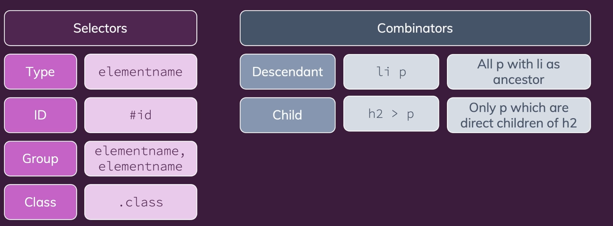
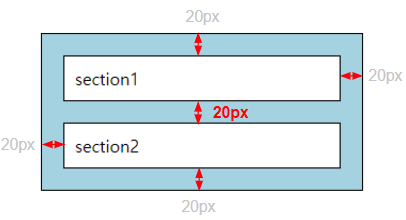
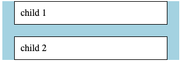
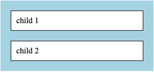

# HTML & CSS

# HTML

- Semantic: what to display, what to do
- HTML skeleton
    
    ```html
    <!DOCTYPE html>
    <html>
    	<head>
    		<title>My Page Title</title>
    		<!-- Other metadata -->
    	</head>
    	<body>
    		<h1>Hi there!</h1>
    		<!-- Other page content -->
    	</body>
    </html>
    ```
    
    - `<head>` for metadata
    - `<body>` for page content
        1. Block elements (e.g. `h1`, `p`, `ul`, …)
        2. Inline elements (e.g. `a`, `span`, `img`)

### `<head>` Elements

- `<meta>`: extra metadata to the page - picked up by search engine crawlers
- `<title>`: defines a page title (browser tabs)
- `<style>`: defines global CSS styles for the page
- `<link>`: links the HTML file to some other resource (typically to a .css file)

### `<body>` Elements

- `<h1>, <h2>, <h3> etc.`: Headings (titles) which you can add to your page.
- `<p>`: defines a regular paragraph of inline content
- `<em>`: emphasis (italic)
- `<strong>`: emphasis (bold)
- ``: displays an image. sets the image source path via the `src` attribute and sets some alternative text via the `alt` attribute
- `<ul>/<ol>`: ordered or unordered lists of data.
- `<li>`: (inside of <ul> or <ol>) defines the individual list items of that list.
- `<header>`: A block element that defines a header
- `<footer>`: A block element that defines a footer
- `<main>`: main content of a page (should not have more than one <main> element per HTML document).
- `<section>`: defines a new section in your document - typically contains a heading (e.g. `<h2>`)
- `<span>`: meaningless inline element targeted with CSS styling (e.g. with help of a CSS `class` or an `id`)
- `<div>`: meaningless block element targeted with CSS styling (e.g. with help of a CSS `class` or an `id`)

### Class & id

- `#id`
    - When setting an ID, only one ID can be specified.
- `.class`
    - When setting a class, you can specify two or more classes using a space.

# CSS

- Cascading Style Sheets: how things look (style of the HTML document)
    
    ```css
    h1 { /* is applied to ALL <h1> elements */
    	font-size: 20px;
    }
    #some-id { /* is applied to a single HTML element with **id**="some-id" */
     color: #ccc;
    }
    .my-link { /* is applied to ALL HTML elments with **class**="my-link" */
     text-decoration: none;
    }
    a:hover { /* targets <a> where the user's mouse is hovering over */
    	font-weight: bold;
    }
    ```
    
    
    

### The Box Model

- This means that all HTML elements do have various "layers" that can be styled:
    
    
    
    1. `content`
    2. `padding` : around the content (but inside of the border)
    3. `border`
    4. `margin` : around the entire element
- Block & Inline elements
    - **Block elements**: behaves as described above image. Size can adjust the size using the `width` and `height` properties.
    - **Inline elements**: Vertical margin is ignored, vertical padding is added but does not push other elements or content away. Size cannot be adjusted with the `width` and `height` properties.
- **`display: inline-block`**
    - can set `width` and `height`, and top and bottom `margin` and `padding` are also applied.

### Specificity

1. High specificity beats low specificity.
2. The type of selector is important: `ID` selector > `class` selector > tag selector.
3. Code order also plays a role, but specificity is more important.

### Inheritance

- HTML elements can be styled by rules that target their parents or ancestor elements as well as rules that target them directly.
    
    ```html
    <style>
    body {
    	font-family: 'Open Sans', sans-serif;
    	text-align: center;
    }
    
    p {
    	margin: 20px;
    }
    </style>
    
    <body>
    	<h1>I use 'Open Sans' as a font-family!</h1>
    	<p>So do I! And we're both aligned to the center.</p>
    </body>
    ```
    
    - Inheritance means that child elements inherit styles from their parent elements.
    - Not all CSS properties are inherited: text color, most font styles, etc. are inherited, but margins, padding, borders, etc. are not.

### margin collapsing

- A phenomenon in which the margin between elements adjacent to each other above and below decreases.
1. Top and bottom margin collapse between sibling elements
    
    
    
    ```html
    <div>
      <section>section1</section>
      <section>section2</section>
    </div>
    
    <style>
    	div {
    		background-color: lightblue;
    		border: 1px solid black;
    		margin: 30px auto;
    		width: 300px;
    	}
    	
    	section {
    	  border: 1px solid black;
    	  padding: 10px;
    	  margin: **20px**;
    	  background-color: white;
    	}
    </style>
    ```
    
2. Margin collapse between parent and child elements
    
    
    
    ```html
    <div class="parent">
      <div class="child">
        child 1
      </div>
      <div class="child">
        child 2
      </div>
    </div>
    
    <style>
    .parent {
      background-color: lightblue;
      width: 300px;
    }
    
    .child {
      border: 1px solid black;
      padding: 10px;
      background-color: white;
      margin: 20px;
    }
    </style>
    ```
    
    - This is because the `margin-top` of the first child and the `margin-bottom` of the last child were not applied. If checking the CSS, we can see that no margin is given to the parent, but the margin value of the child element exceeds the parent area.
    
    ### Solution
    
    
    
    1. Applying the `overflow` property to the parent element
        - If you give the overflow: hidden property to the parent element, top and bottom margins are applied.
            
            ```css
            .parent {
            	overflow: hidden;
            }
            ```
            
    2. `inline-block` to the parent element
        - keep in mind! → elements that are equivalent to the parent element can appear next to each other.
        
        ```css
        .parent {
        display: inline-block;
        }
        ```
        
    3. `border` value to parent element (border: none does not solve the problem.)
        
        ```css
        .parent {
        border: 1px solid black;
        }
        ```
        

### CSS Properties

- Font-related:
    - `font-family`: specifies the typeface, allowing a list of fallbacks.
    - `font-size`: text size - "device independent" pixels (e.g. 18px) or other values
    - `font-weight`: adjusts text weight; requires font support for specific weights.
- Text:
    - `text-align`: the alignment of the text (e.g. center, left, right)
    - `text-decoration`: Can be used to add extra decoration (or remove it) like underlining (e.g. text-decoration: underline)
- Colors:
    - `color`: text color
    - `background-color`: background color of an element
    - Colors can be set with differnt kinds of units:
        1. Hexadecimal number identifiers (e.g. `#fa923f`, `#ccc`)
        2. `rgb()` : r/g/b color with decimal numbers
        3. `hsl()` : hue/saturation/ lightness
        4. `rgba()` & `hsla()` : adds an "alpha channel" (transparency - value 0 ~ 1)
- Box Model:
    - `margin`: extra spacing around an element - set with pixels (e.g. `18px`)
        - `margin` is the shorthand notation that sets spacing in all directions (e.g. `margin: 10px 5px 8px 3px`)
        - also have `margin-left`, `margin-right`, `margin-top` and `margin-bottom` to target specific directions
    - `padding`: extra spacing inside of an element - set with pixels (e.g. `18px`)
        - like margin, target specific directions such as `padding-bottom`
    - `border`: visible border around the element content + padding (e.g. `border: 1px solid black`)
    - `border-radius`: rounds the corners of an element's border
- Sizes:
    - `width`: fixed width for an element
    - `height`: fixed height for an element
- Other:
    - `box-shadow`: set by defining a ( x-offset, y-offset, an optional blur radius, an optional spread radius and a color ) - (e.g. `box-shadow: 0 1px 8px rgba(0, 0, 0, 0.2)`)